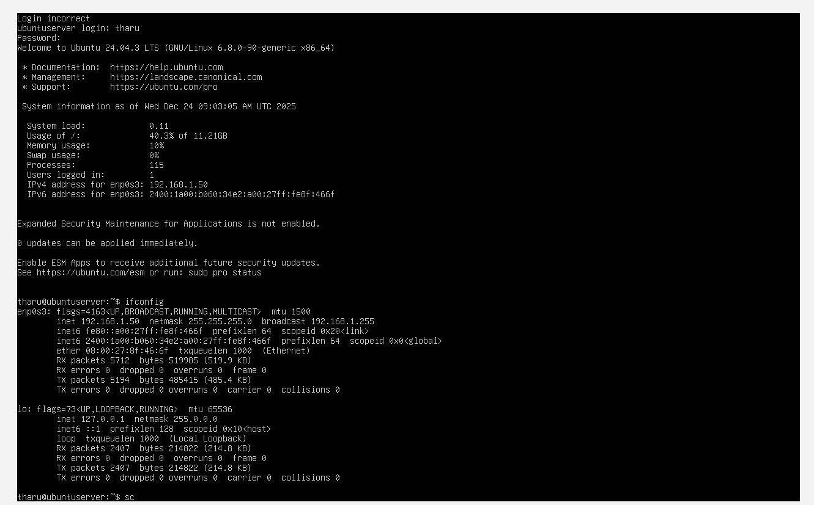
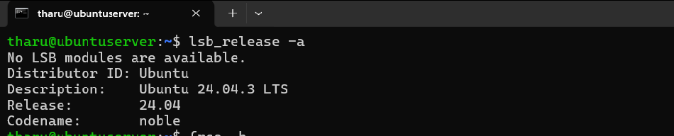

# Operating Systems - Technical Journal

## Phase 1: Planning & System Architecture

### 1. Project Overview

This journal documents the development, security hardening, and performance analysis of a headless Linux server. The goal is to build a sustainable, secure, and efficient server environment as part of the coursework.

### 2. System Architecture Diagram

To ensure a secure management environment, I have implemented a dual-system architecture. The "Workstation" acts as the control node, while the "Server" remains headless to minimize resource consumption and reduce the attack surface.

### 3. Distribution Selection & Justification

For this project, I have selected **Ubuntu Server 24.04 LTS**.

| Feature          | Selection               | Justification                                                                                              |
| :--------------- | :---------------------- | :--------------------------------------------------------------------------------------------------------- |
| **Distribution** | Ubuntu Server 24.04 LTS | Offers 5 years of security updates (LTS), high stability, and extensive documentation for troubleshooting. |
| **Interface**    | Headless (CLI Only)     | Eliminates the overhead of a Graphical User Interface (GUI), saving RAM and CPU for server applications.   |
| **Environment**  | VirtualBox VM           | Allows for snapshots and safe testing of security configurations without affecting the host machine.       |

### 4. Networking Strategy

I have configured the network using a **Host-Only Adapter** in VirtualBox.

- **Reasoning:** This creates a private network between my workstation and the server. It prevents the server from being exposed to the public internet during the initial setup phase while allowing full SSH control.
- **Workstation IP:** `192.168.56.1` (Host)

- **Server IP:** `192.168.1.50`

### 5. Baseline System Specifications

Upon initial installation, the following baseline data was captured to serve as a benchmark for future performance testing:

**System Info:**

- **Kernel Version:** `uname -a`

  

-
- **OS Version:** Ubuntu 24.04 LTS

**Initial Resource Usage:**

- **Check the system version:** `lsb_release -a`

- **RAM usage (Idle):** `free -h`

  

- **Disk Usage:** `df -h`

  

- **Check the IP address to ensure your Host-Only network is working:** `ip addr`

---

### 6. Phase 1 Reflection

During the setup, I encountered [mention a challenge, e.g., configuring the Host-Only network]. I resolved this by [mention solution]. This phase established the importance of planning for sustainability by choosing a headless distribution to conserve energy and hardware resources.
